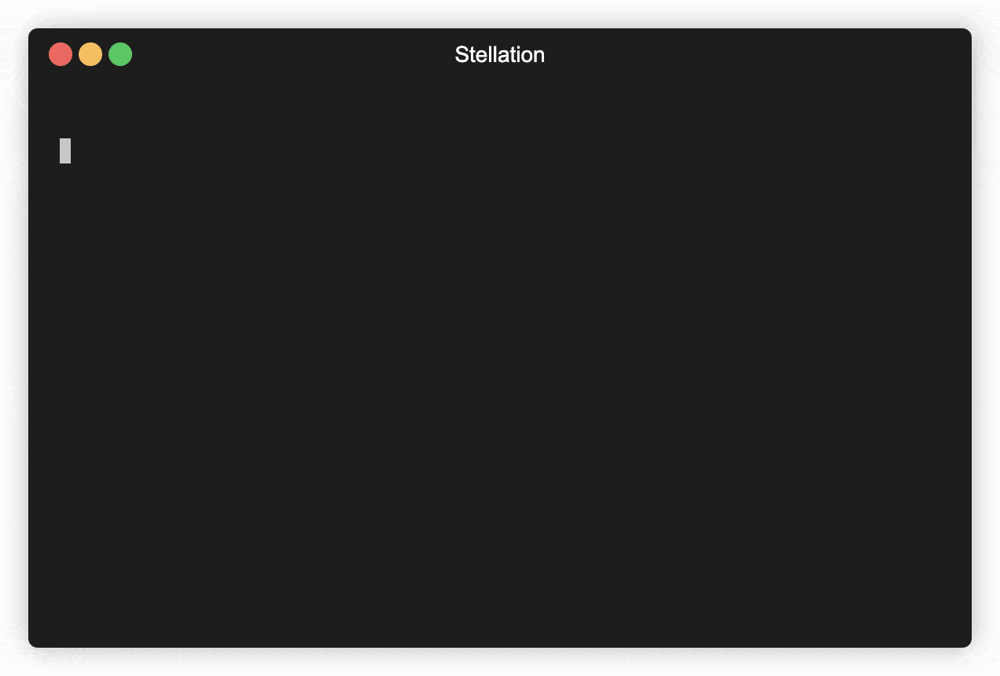

# stellation

A framework experience for Yew.

Stellation provides a development stack with:

1. Tooling around Server-side Rendering Support.
2. An easy-to-use, SSR-transparent RPC Implementation.
3. A development server that automatically rebuild upon changes.
4. A single binary distribution with embedded frontend.

# Quickstart Guide

  

1. Install required tools

   Stellation uses the following tools:

   - Trunk
   - cargo-generate
   - cargo-make

They can be installed with `cargo install trunk cargo-generate cargo-make`

2. Create project

   Run `cargo generate futursolo/stellation-templates` and follow the prompt.

3. Start development server

   Run `cargo make --quiet start` in the project directory.

   (This may take a couple minutes when the project is building for the first time.)
